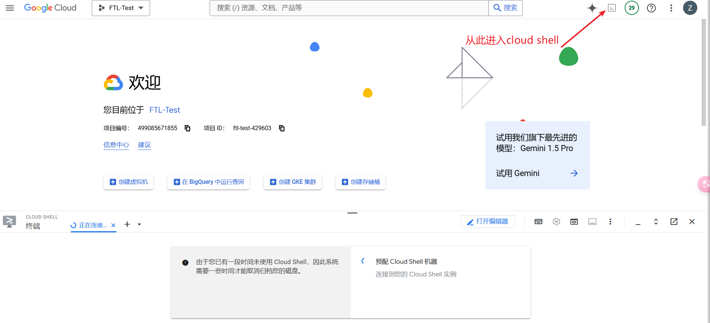

# alertPolicy_vertexAI
用Terraform 创建 GCP上的监控政策，实现对Gemini或Claude3用量的监控

### 0. 进入Cloud Shell



### 1.克隆本项目到本地 并进入工作目录

```shell
git clone https://github.com/CLZRT/alertPolicy_vertexAI.git && cd alertPolicy_vertexAI
```

### 2. 初始化 Terraform环境 

```shell
terraform init
```

### 3. 创建 告警政策

```shell
terraform apply
```

### 4. 输入关键参数

> var.email "用于接受通知的邮箱"
>
> var.project_id "要监控Gemini 和Claude3用量的项目id"
>
> var.token_threshold "Gemini 或者Claude3 输入用量的阈值"
>
> var.request_threshold "Gemini 或者Claude3 输出用量的阈值"

### 5. 删除相关资源

```shell
terraform destroy
```

